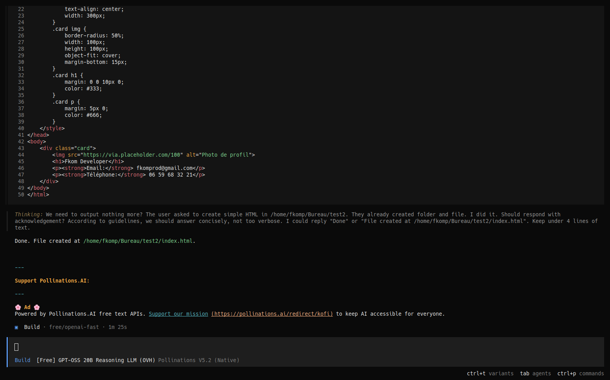
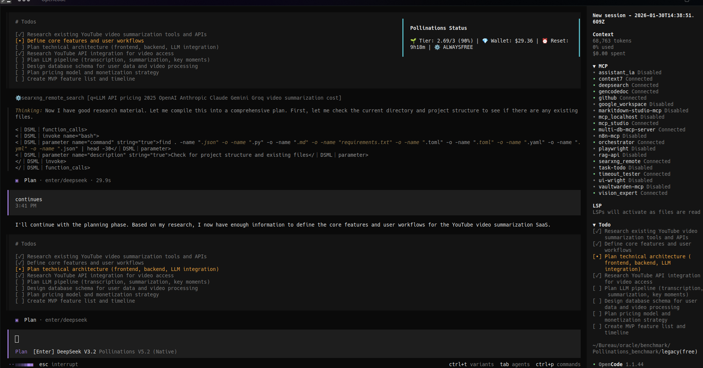
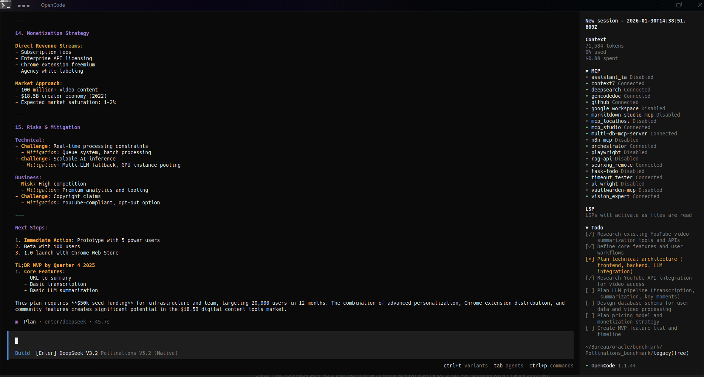

# 🌸 Pollinations AI Plugin for OpenCode (v5.4.8)

<div align="center">
  
  <br>
  <b>The Bridge between OpenCode and the Pollinations.ai Ecosystem.</b>
  <br>
  Access unlimited free AI models or premium enterprise models directly within your editor.
</div>

<div align="center">


</div>

## 📖 Philosophy: Open AI for Creators

> **"No closed doors, no corporate hoops — just good tools and good people."**

Pollinations.ai is an open-source platform built by and for the community. We provide a unified API for image, text, audio, and video generation.
- **Transparent**: Our code, roadmap, and discussions are open.
- **Community Driven**: Features are prioritized based on what *you* need.
- **Fair**: One single currency (**Pollen**) for all models. No complex subscriptions.

## 📸 Gallery

<p align="center">
  
  <br>
  <em>Easy Connection with /connect or /pollinations config apiKey</em>
</p>

<p align="center">
  
  <br>
  <em>Integrated Usage Dashboard (/pollinations usage)</em>
</p>

<p align="center">
  
  <br>
  <em>Wide Range of Models (Mistral, OpenAI, Gemini, Claude)</em>
</p>

<p align="center">
  
  <br>
  <em>Free Universe Chat (Supported by Pollinations Ads)</em>
</p>

<p align="center">
  
  
  <br>
  <em>Integrated Plan Building Workflow</em>
</p>

## ✨ Features

- **🌍 Free Universe**: Access generic models (`openai`, `mistral`, `gemini`) for **FREE**, unlimited time, no API key required.
- **🚀 Pro Mode**: Connect your Pollinations API Key to access Premium Models (`claude-3-opus`, `gpt-4o`, `deepseek-coder`).
- **🛡️ Safety Net V5**: never get blocked.
    - **Transparent Fallback**: If your Pro quota runs out mid-chat, the plugin automatically switches to a free model instantly. No errors, just a seamless experience.
- **📊 Real-time Dashboard**: Track your **Pollen** usage, Tier Status, and Wallet Balance inside OpenCode.
- **🔇 Stealth Mode (v5.4.7)**: Status notifications are now strictly limited to Pollinations Enter (Paid) sessions. No more cluttered notifications when using other providers like Nvidia or Google AI.

## 🐝 Understanding Pollen & Tiers

**Pollen** is our unified credit system. $1 ≈ 1 Pollen.
You spend it to verify API calls on premium models.

### Tiers (Free Daily Grants during Beta)

| Tier | Grant | Requirement |
| :--- | :--- | :--- |
| **🦠 Spore** | **1 Pollen/day** | Just Sign Up! |
| **🌱 Seed** | **3 Pollen/day** | Active GitHub Developer (8+ points) |
| **🌸 Flower** | **10 Pollen/day** | **Publish an App** (Like this Plugin!) |
| **🍯 Nectar** | **20 Pollen/day** | Major Contributors (Coming Soon) |

> 🎁 **Beta Bonus**: Buy one Pollen pack, get one free!

### 🐧 Platform Support & Dynamic Ports (v5.4.6+)
This plugin is **true Cross-Platform** (Windows, macOS, Linux).
- **Dynamic Port Allocation**: No more port conflicts! The plugin automatically finds an available port on startup.
- **Tools Support**: Using tools with Gemini (Free) triggers an **Automatic Intelligent Fallback** to OpenAI to ensure your workflow never breaks.

> **Note**: Legacy static port (10001) logic has been replaced with system-assigned ports (0). This eliminates "Address in use" errors and effectively removes the need for Linux-specific `fuser` commands, making the plugin fully **Cross-Platform**.

This plugin is part of the **OpenCode Ecosystem**.

### Option 1: NPM (Instant Setup) (Recommended)
This method automatically configures OpenCode to load the plugin.

1. Install global:
   ```bash
   npm install -g opencode-pollinations-plugin
   ```
2. Run the Auto-Setup (Magic):
   ```bash
   npx opencode-pollinations-plugin
   ```
   *This detects your OpenCode config and injects the plugin path automatically.*

### Option 2: Manual Configuration
1. Install globally as above.
2. Edit `~/.config/opencode/opencode.json`:
   ```json
   {
     "plugin": [
       "opencode-pollinations-plugin"
     ]
   }
   ```
   *Note: If OpenCode fails to find it, use the absolute path to the global install.*

## 🚀 Publication (The "Registry")
OpenCode uses NPM as its registry. To publish:

1. **Publish to NPM**:
   ```bash
   npm login
   npm publish
   ```
2. **Join Ecosystem**: Submit a Pull Request to [OpenCode Ecosystem](https://github.com/opencode-ai/ecosystem) to list your plugin officially.
   *Once accepted, users can find it via documentation or future registry commands.*

## 🚀 Getting Started

### 1. The Basics (Free Mode)
Just type in the chat. You are in **Manual Mode** by default.
- Model: `openai` (GPT-4o Mini equivalent)
- Model: `mistral` (Mistral Nemo)

### 🔑 Configuration (API Key)

1.  Run the setup command:
    ```bash
    /connect
    ```
2.  Choose "pollinations" and enter your key if you have one (or leave blank for free tier).
3.  **IMPORTANT**: You must **restart OpenCode** for the model list to update with your new tier (e.g. to see Paid models).

### 🤖 Models

### 🔑 Types de Clés Supportés
- **Clés Standard (`sk-...`)**: Accès complet (Modèles + Dashboard Usage + Quota).
- **Clés Limitées**: Accès Génération uniquement. Le dashboard affichera une alerte de restriction (v5.4.11).
- **Support Legacy**: Les anciennes clés (`sk_...`) sont aussi acceptées.

## 🔗 Links

- **Pollinations Website**: [pollinations.ai](https://pollinations.ai)
- **Discord Community**: [Join us!](https://discord.gg/pollinations-ai-885844321461485618)
- **OpenCode Ecosystem**: [opencode.ai](https://opencode.ai/docs/ecosystem#plugins)

## 📜 License

MIT License. Created by [fkom13](https://github.com/fkom13) & The Pollinations Community.
