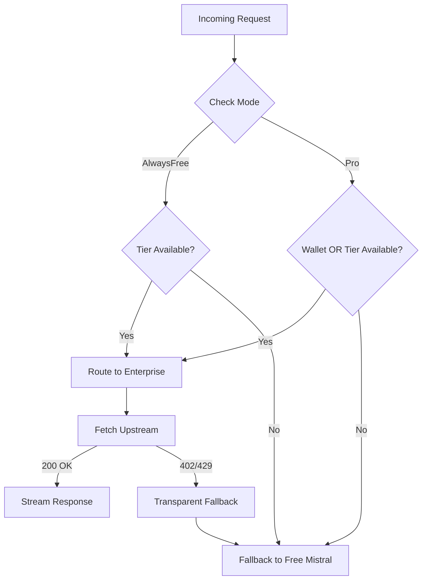

# 📘 Pollinations OpenCode Plugin - Technical Manual v5.1.3

**Version**: 5.1.3 (Hotfix Hardening)
**Date**: 27/01/2026
**Engine**: Node.js / TypeScript
**Architecture**: Native HTTP Proxy with Safety Nets

---

## 🏗️ Architecture Global

Ce plugin agit comme un **Proxy Intelligent Interne** (`localhost:11434` ou via pipe OpenCode) qui intercepte les requêtes de chat, applique une logique de routage stricte, gère l'authentification Pollinations, et protège le quota de l'utilisateur via des "Safety Nets".

### Composants Clés

1.  **Server (`proxy.ts`)** : Cœur du système. Gère le flux HTTP/SSE.
2.  **Quota Manager (`quota.ts`)** : Module critique utilisant `https` natif pour interroger l'API Pollinations (`profile`, `balance`, `usage`).
3.  **Config Manager (`config.ts`)** : Gère la persistance (`.pollinations/config.json`) et la migration automatique depuis V4.
4.  **Toast Manager (`toast.ts`)** : Système de notifications UI unifié.

---

## 🛡️ Logic Block: The "Safety Net" (V5 Core)

La grande innovation de la V5 est le **Safety Net**, une logique décisionnelle exécutée *avant* chaque requête pour garantir qu'un utilisateur ne se retrouve jamais bloqué ou facturé par erreur.

### 1. Modes de Fonctionnement
- **Manual**: Aucune protection. Routage direct vers la clé API si présente.
- **AlwaysFree**: Force l'usage gratuit (`text.pollinations.ai`). **Safety Net** : Si l'utilisateur force un modèle "Enterprise" (ex: `enter/claude`), le système vérifie si le **Free Daily Tier** est disponible. Si vide -> **Fallback**.
- **Pro**: Autorise Enterprise. **Safety Net** : Vérifie le **Wallet** ET le **Tier**. Si les deux sont vides (< 0.1), bascule sur Free pour éviter le rejet 402.

### 2. Flux de Décision (Simplified)



---

## ⚡ Features & Hotfixes (v5.1.3)

### 1. Transparent Fallback (v5.1.3)
Si, malgré les vérifications pré-vol, l'API Pollinations rejette la requête en cours de route (ex: épuisement pile poil pendant le stream) avec une erreur `402 Payment Required` ou `429 Rate Limit` :
- Le Proxy **capture** l'erreur (ne la renvoie pas au client).
- Il **change** le modèle cible vers `fallback.free.main` (Mistral).
- Il **relance** immédiatement la requête.
- L'utilisateur reçoit sa réponse (basculée) sans interruption.
- Une notification `⚠️ Safety Net` est injectée à la fin du message.

### 2. Native HTTPS Quota (v5.1.2)
Remplacement de `fetch` par le module Node.js `https` natif dans `quota.ts` pour résoudre des problèmes de connectivité SSL/Headers spécifiques à certains environnements Linux/OpenCode.
Alignement strict avec le script de monitoring externe (`pollinations-usage`).

### 3. Stream Notification (v5.1.1)
Injection d'un chunk SSE artificiel à la **FIN** du flux pour avertir l'utilisateur d'un fallback, sans polluer le début de la réponse (User UX improved).

### 4. Quota Unreachable Handling
Si l'API Quota est inaccessible (Timeou / Clé invalide 403) :
- Le système adopte une stratégie **Fail Closed** (Sécurité maximale).
- On considère `Quota = 0`.
- Le Safety Net s'active avec la raison : `"Quota Unreachable (Safety)"`.

---

## 🔧 Configuration (`config.json`)

Le fichier de configuration est stocké dans `~/.pollinations/config.json`.

```json
{
  "version": 5,
  "mode": "pro",
  "gui": { "status": "all", "logs": "error" },
  "thresholds": { "tier": 10, "wallet": 5 },
  "fallbacks": {
    "free": { "main": "free/mistral", "agent": "free/gemini-thinking" },
    "enter": { "agent": "free/gemini-thinking" }
  },
  "apiKey": "sk_..."
}
```

---

## 🚀 Commandes Supportées

- `/pollinations usage` : Affiche le Dashboard ASCII + Toast.
- `/pollinations mode [pro|alwaysfree|manual]` : Change le mode à la volée.
- `/pollinations config [key] [value]` : Modifie une valeur de config.
- `/pollinations fallback [main|agent] [model]` : Configure les modèles de repli.
