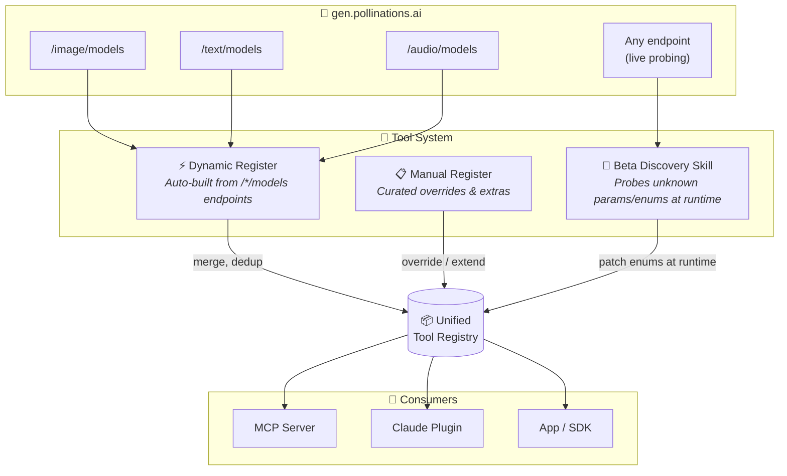
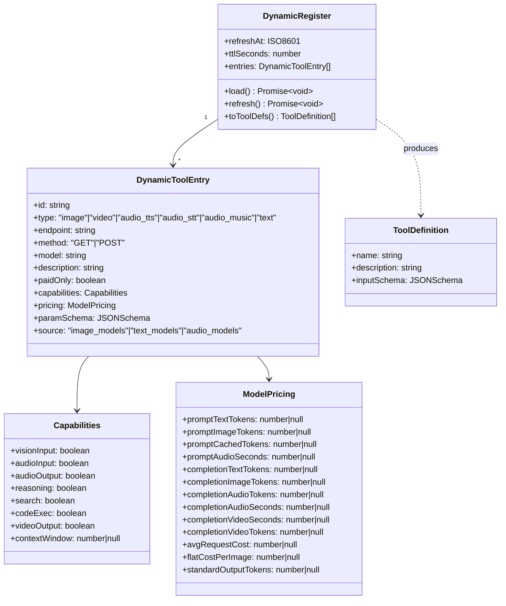
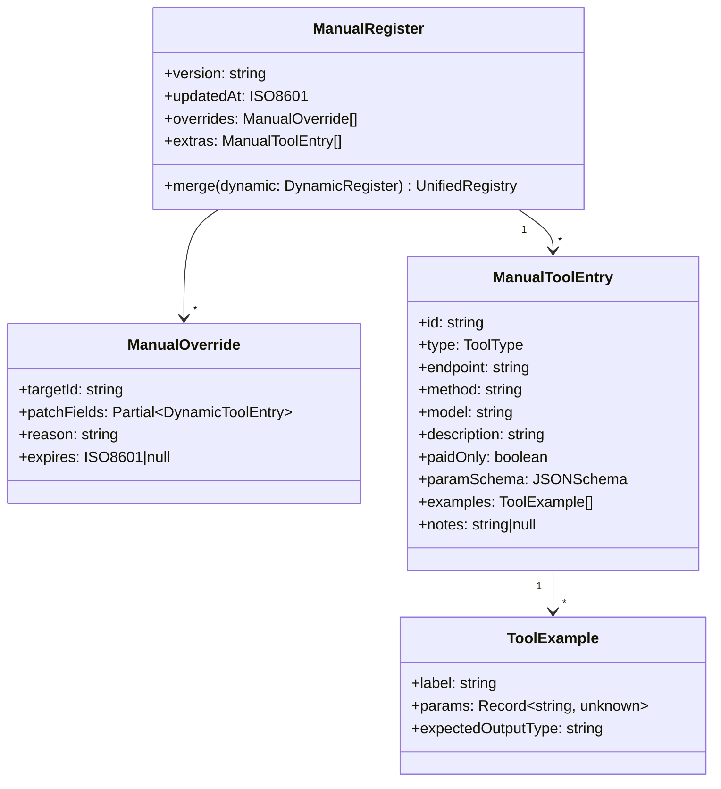
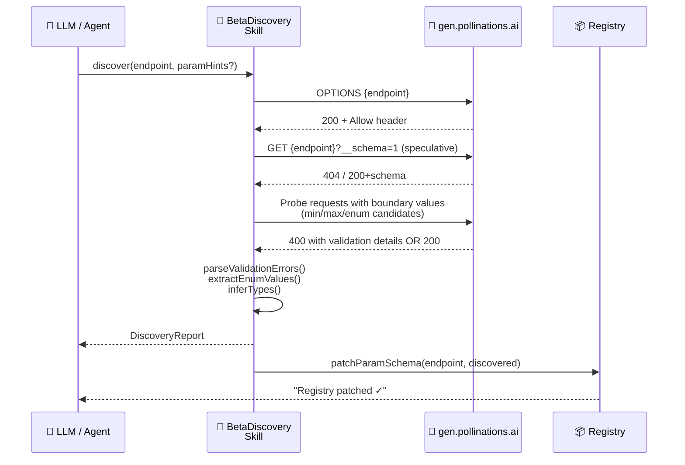
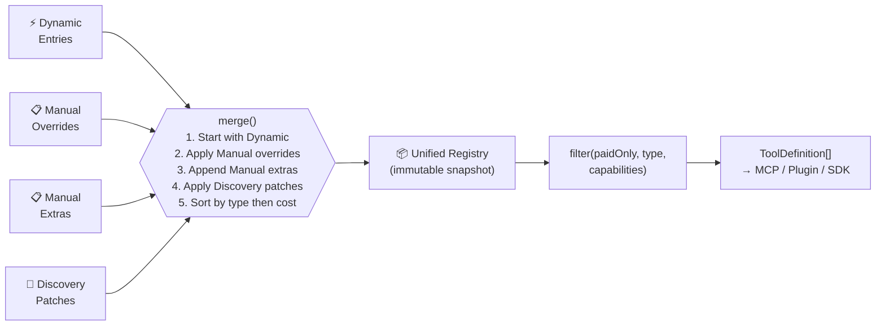
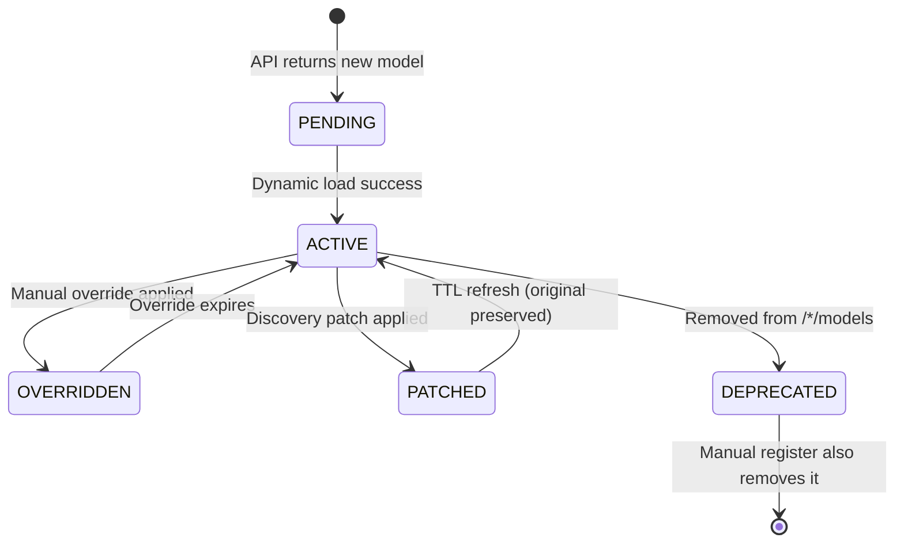

# Plugin Pollinations — Target Architecture (Post-Audit)

> **Three-layer tool system:** Dynamic register (API-discovered) · Manual register (curated overrides) · Beta Discovery Skill (param/enum explorer)

---

## 1. Global Overview



---

## 2. Dynamic Register — Schema

Auto-populated at startup by calling the three model-list endpoints.



### Dynamic Entry JSON Schema

```jsonc
{
  "$schema": "http://json-schema.org/draft-07/schema#",
  "title": "DynamicToolEntry",
  "type": "object",
  "required": ["id", "type", "endpoint", "method", "model", "paramSchema"],
  "properties": {
    "id":          { "type": "string", "description": "Unique tool ID, e.g. 'generate_image_flux'" },
    "type":        { "type": "string", "enum": ["image","video","audio_tts","audio_stt","audio_music","text"] },
    "endpoint":    { "type": "string", "example": "https://gen.pollinations.ai/image/{prompt}" },
    "method":      { "type": "string", "enum": ["GET","POST"] },
    "model":       { "type": "string", "example": "flux" },
    "description": { "type": "string" },
    "paidOnly":    { "type": "boolean", "default": false },
    "capabilities": {
      "type": "object",
      "properties": {
        "visionInput":    { "type": "boolean" },
        "audioInput":     { "type": "boolean" },
        "audioOutput":    { "type": "boolean" },
        "reasoning":      { "type": "boolean" },
        "search":         { "type": "boolean" },
        "codeExec":       { "type": "boolean" },
        "videoOutput":    { "type": "boolean" },
        "contextWindow":  { "type": ["integer", "null"] }
      }
    },
    "pricing": {
      "type": "object",
      "description": "Raw pricing fields from /*/models endpoint",
      "additionalProperties": { "type": ["number", "null"] }
    },
    "paramSchema": {
      "type": "object",
      "description": "JSON Schema for the tool's input parameters (path + query or body)"
    }
  }
}
```

---

## 3. Manual Register — Schema

Curated entries that override auto-discovered ones OR add capability the API endpoints don't expose.



### Manual Register YAML Example

```yaml
version: "1.3.0"
updatedAt: "2026-02-20T00:00:00Z"

overrides:
  # Correct nanobanana-pro pricing while API issue #6385 is open
  - targetId: generate_image_nanobanana-pro
    patchFields:
      pricing:
        completionImageTokens: 0.000120   # 120/M per output image token
        flatCostPerImage: 0.1429          # 1/7 pollen per image at standard res
    reason: "API returns stale value; real cost confirmed via billing"
    expires: null

  # Mark wan as ALPHA (API doesn't flag it)
  - targetId: generate_video_wan
    patchFields:
      description: "Wan 2.6 · Text-to-video · ⚠️ ALPHA — may be unstable"
    reason: "api.airforce provider, experimental"
    expires: null

extras:
  # Account tools not in /*/models
  - id: get_account_balance
    type: utility
    endpoint: "https://gen.pollinations.ai/account/balance"
    method: GET
    model: ""
    description: "Returns remaining pollen balance for the authenticated user"
    paidOnly: false
    paramSchema:
      type: object
      properties: {}
    examples:
      - label: "Check my balance"
        params: {}
        expectedOutputType: "{ balance: number }"

  - id: get_account_usage_daily
    type: utility
    endpoint: "https://gen.pollinations.ai/account/usage/daily"
    method: GET
    model: ""
    description: "Returns daily aggregated usage records (date, model, cost_usd)"
    paidOnly: false
    paramSchema:
      type: object
      properties: {}
```

---

## 4. Beta Discovery Skill — Spec

Runtime tool that probes live endpoints to surface undocumented params and enum values.



### BetaDiscovery Skill — TypeScript Interface

```typescript
// ── Beta Discovery Skill ─────────────────────────────────────────────────────

export interface DiscoveryProbe {
  /** Endpoint path pattern, e.g. "/image/{prompt}" */
  endpoint: string;
  /** Known params to skip (already in registry) */
  knownParams?: string[];
  /** Candidate enum values to test per param */
  enumCandidates?: Record<string, string[]>;
  /** Max HTTP requests to issue during discovery */
  maxProbes?: number;  // default: 20
}

export interface DiscoveredParam {
  name: string;
  in: "path" | "query" | "body";
  inferredType: "string" | "integer" | "boolean" | "number";
  enumValues?: string[];      // discovered via 400 validation messages
  minValue?: number;
  maxValue?: number;
  defaultValue?: unknown;
  isRequired: boolean;
  confidence: "high" | "medium" | "low";
  discoveredBy: "validation_error" | "successful_probe" | "options_header" | "schema_endpoint";
  rawEvidence: string;        // snippet from API response that surfaced this
}

export interface DiscoveryReport {
  endpoint: string;
  probedAt: string;            // ISO 8601
  probesIssued: number;
  newParams: DiscoveredParam[];
  patchedEnums: Record<string, string[]>; // param → new enum values found
  warnings: string[];          // e.g. "Probe limit reached before exhausting candidates"
  suggestedSchemaFragment: JSONSchema;
}

export interface BetaDiscoverySkill {
  /**
   * Main entry point: probe an endpoint and return a discovery report.
   * The skill automatically patches the registry with high-confidence findings.
   */
  discover(probe: DiscoveryProbe): Promise<DiscoveryReport>;

  /**
   * Quick enum scan: given a param name and candidate values, 
   * return which ones are accepted by the API.
   */
  scanEnums(
    endpoint: string,
    paramName: string,
    candidates: string[]
  ): Promise<{ valid: string[]; invalid: string[]; unknown: string[] }>;

  /**
   * Detect new models added to /*/models since last refresh.
   */
  diffModels(
    type: "image" | "text" | "audio"
  ): Promise<{ added: string[]; removed: string[]; changed: Record<string, unknown> }>;
}
```

### Discovery Probing Strategy

```mermaid
flowchart TD
    START([discover\nendpoint]) --> OPT[OPTIONS request\n→ parse Allow header]
    OPT --> SCHEMA{Try\n?__schema=1\nor /schema}
    SCHEMA -->|Schema found| PARSE_SCHEMA[Parse OpenAPI fragment\nhigh confidence] --> PATCH
    SCHEMA -->|404| BOUNDARY[Probe boundary values\nmin / max / edge cases]
    BOUNDARY --> ENUM_PROBE[For each paramHint:\nsend known enum candidates\none by one]
    ENUM_PROBE --> PARSE_400[Parse 400 ValidationErrorDetails\n→ extract enum list from\n'must be one of: [...]' messages]
    PARSE_400 --> INFER[Infer type from:\n- value that succeeded\n- error message wording\n- field name heuristics]
    INFER --> REPORT[Build DiscoveryReport\nconfidence-scored]
    REPORT --> PATCH{Confidence\n≥ high?}
    PATCH -->|Yes| AUTO_PATCH[Auto-patch Registry\nparamSchema]
    PATCH -->|No| SUGGEST[Return suggestion\nfor human review]
    AUTO_PATCH --> DONE([Done])
    SUGGEST --> DONE
```

---

## 5. Unified Registry — Merge Logic



### Registry Entry Lifecycle



---

## 6. File Layout

```
/plugin-pollinations/
├── src/
│   ├── registers/
│   │   ├── dynamic.ts          # DynamicRegister — fetches /*/models
│   │   ├── manual.ts           # ManualRegister  — loads manual.yaml
│   │   ├── manual.yaml         # Curated overrides & extras
│   │   └── unified.ts          # Merge logic → UnifiedRegistry
│   ├── skills/
│   │   └── beta-discovery/
│   │       ├── SKILL.md        # Human-readable skill spec (this doc)
│   │       ├── index.ts        # BetaDiscoverySkill implementation
│   │       ├── probers.ts      # Boundary / enum / schema probers
│   │       └── parser.ts       # 400 ValidationError → enum extractor
│   ├── types.ts                # All shared interfaces
│   └── registry.ts             # Public API: getRegistry(), refreshRegistry()
├── pollinations_pricing.ts     # Live pricing reporter (standalone script)
└── Tool_System_Model_dynamical_architecture.md
```

---

## 7. Key Design Decisions

| Decision | Rationale |
|---|---|
| Dynamic register has TTL (default 5 min) | Model list changes; avoid stale tool defs |
| Manual overrides have `expires` field | Forces re-audit; avoids silent permanent hacks |
| Discovery uses 400 errors, not only OPTIONS | The Pollinations API surfaces enum values in ValidationErrorDetails |
| Discovery patches are low-trust by default | Auto-apply only if confidence=high; rest go to review queue |
| `avgRequestCost` field checked first in pricing | API may expose this precomputed field; fall back to formula if absent |
| Flat image cost vs token-based image cost separated | gptimage uses per-token billing; flux uses flat; detection via presence of `promptTextTokens` |
