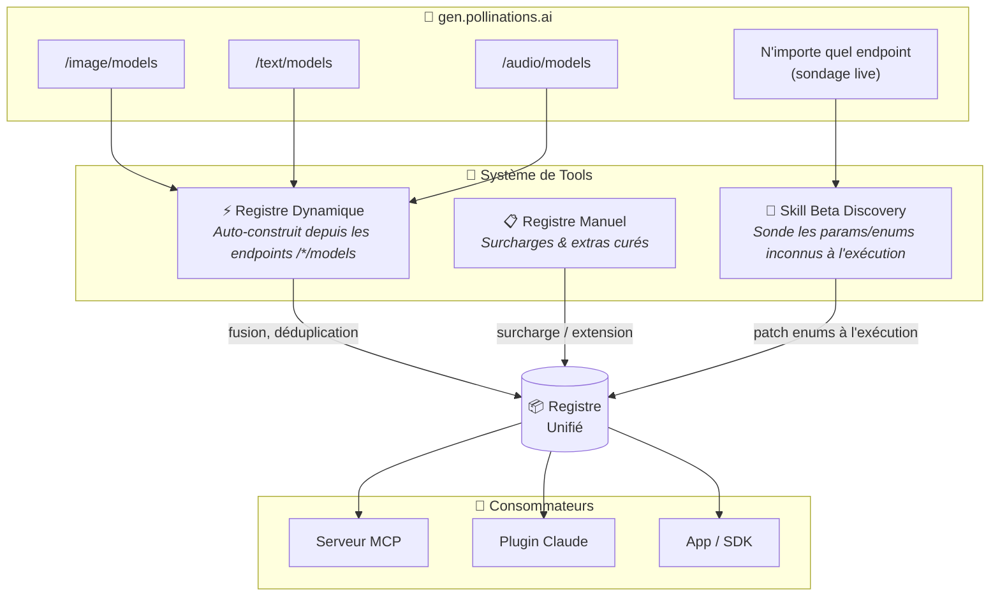
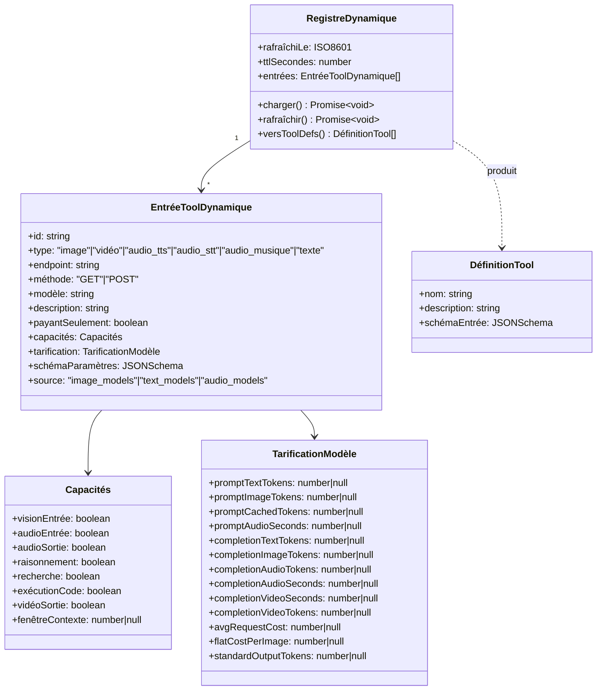
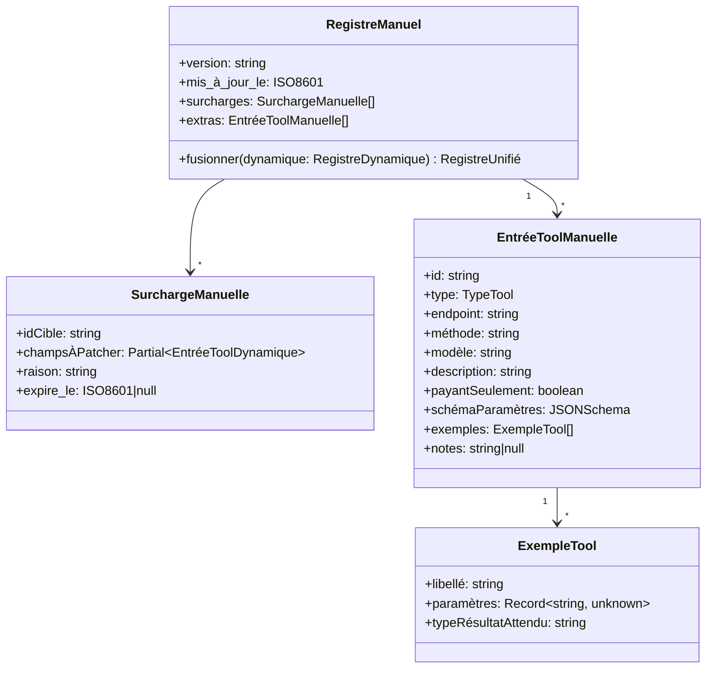
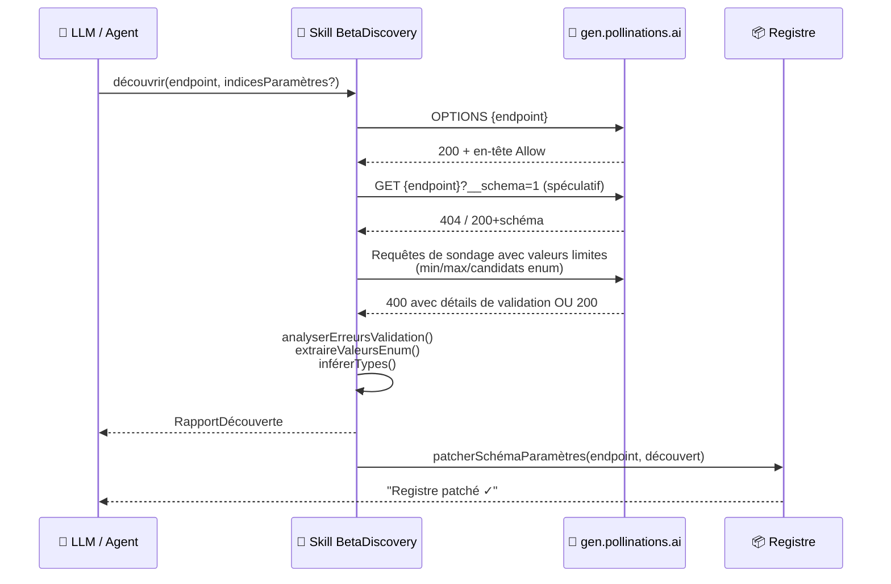
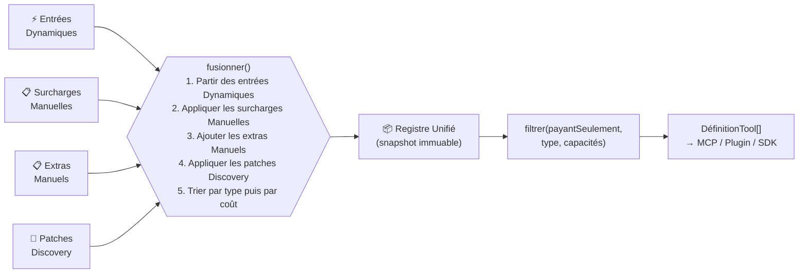
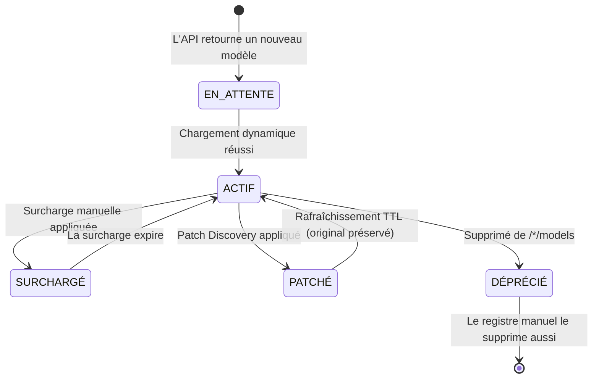

# Plugin Pollinations — Architecture Cible (Post-Audit)

> **Système à trois couches :** Registre dynamique (découverte via API) · Registre manuel (surcharges curées) · Skill Beta Discovery (explorateur de paramètres/enums)

---

## 1. Vue d'ensemble globale



---

## 2. Registre Dynamique — Schéma

Peuplé automatiquement au démarrage en appelant les trois endpoints de liste de modèles.



### Schéma JSON d'une entrée dynamique

```jsonc
{
  "$schema": "http://json-schema.org/draft-07/schema#",
  "title": "EntréeToolDynamique",
  "type": "object",
  "required": ["id", "type", "endpoint", "méthode", "modèle", "schémaParamètres"],
  "properties": {
    "id":          { "type": "string", "description": "ID unique du tool, ex. 'generate_image_flux'" },
    "type":        { "type": "string", "enum": ["image","vidéo","audio_tts","audio_stt","audio_musique","texte"] },
    "endpoint":    { "type": "string", "example": "https://gen.pollinations.ai/image/{prompt}" },
    "méthode":     { "type": "string", "enum": ["GET","POST"] },
    "modèle":      { "type": "string", "example": "flux" },
    "description": { "type": "string" },
    "payantSeulement": { "type": "boolean", "default": false },
    "capacités": {
      "type": "object",
      "properties": {
        "visionEntrée":    { "type": "boolean" },
        "audioEntrée":     { "type": "boolean" },
        "audioSortie":     { "type": "boolean" },
        "raisonnement":    { "type": "boolean" },
        "recherche":       { "type": "boolean" },
        "exécutionCode":   { "type": "boolean" },
        "vidéoSortie":     { "type": "boolean" },
        "fenêtreContexte": { "type": ["integer", "null"] }
      }
    },
    "tarification": {
      "type": "object",
      "description": "Champs de tarification bruts retournés par l'endpoint /*/models",
      "additionalProperties": { "type": ["number", "null"] }
    },
    "schémaParamètres": {
      "type": "object",
      "description": "JSON Schema des paramètres d'entrée du tool (path + query ou body)"
    }
  }
}
```

---

## 3. Registre Manuel — Schéma

Entrées curées qui **surchargent** les entrées auto-découvertes OU qui **ajoutent** des capacités que les endpoints API n'exposent pas.



### Exemple de Registre Manuel (YAML)

```yaml
version: "1.3.0"
mis_à_jour_le: "2026-02-20T00:00:00Z"

surcharges:
  # Correction de la tarification nanobanana-pro pendant que le bug #6385 est ouvert
  - idCible: generate_image_nanobanana-pro
    champsÀPatcher:
      tarification:
        completionImageTokens: 0.000120   # 120/M par token image en sortie
        flatCostPerImage: 0.1429          # 1/7 pollen par image en résolution standard
    raison: "L'API retourne une valeur périmée ; coût réel confirmé via facturation"
    expire_le: null

  # Marquer wan comme ALPHA (l'API ne le signale pas)
  - idCible: generate_video_wan
    champsÀPatcher:
      description: "Wan 2.6 · Texte-vers-vidéo · ⚠️ ALPHA — peut être instable"
    raison: "Fournisseur api.airforce, expérimental"
    expire_le: null

extras:
  # Tools de compte absents de /*/models
  - id: get_account_balance
    type: utilitaire
    endpoint: "https://gen.pollinations.ai/account/balance"
    méthode: GET
    modèle: ""
    description: "Retourne le solde de pollen restant pour l'utilisateur authentifié"
    payantSeulement: false
    schémaParamètres:
      type: object
      properties: {}
    exemples:
      - libellé: "Vérifier mon solde"
        paramètres: {}
        typeRésultatAttendu: "{ balance: number }"

  - id: get_account_usage_daily
    type: utilitaire
    endpoint: "https://gen.pollinations.ai/account/usage/daily"
    méthode: GET
    modèle: ""
    description: "Retourne les enregistrements d'usage agrégés par jour (date, modèle, cost_usd)"
    payantSeulement: false
    schémaParamètres:
      type: object
      properties: {}
```

---

## 4. Skill Beta Discovery — Spécification

Tool d'exécution qui sonde les endpoints live pour faire remonter les paramètres et valeurs d'enum non documentés.



### Interfaces TypeScript de la Skill Beta Discovery

```typescript
// ── Skill Beta Discovery ─────────────────────────────────────────────────────

export interface SondeDécouverte {
  /** Pattern du chemin endpoint, ex. "/image/{prompt}" */
  endpoint: string;
  /** Paramètres déjà connus à ignorer */
  paramètresConnus?: string[];
  /** Valeurs enum candidates à tester par paramètre */
  candidatsEnum?: Record<string, string[]>;
  /** Nombre maximum de requêtes HTTP à émettre */
  maxSondes?: number;  // défaut : 20
}

export interface ParamètreDiscouvert {
  nom: string;
  dans: "path" | "query" | "body";
  typeInféré: "string" | "integer" | "boolean" | "number";
  valeursEnum?: string[];       // découvertes via messages d'erreur 400
  valeurMin?: number;
  valeurMax?: number;
  valeurDéfaut?: unknown;
  estObligatoire: boolean;
  confiance: "haute" | "moyenne" | "faible";
  découvertPar: "erreur_validation" | "sonde_réussie" | "en-tête_options" | "endpoint_schéma";
  preuvesBrutes: string;        // extrait de la réponse API qui a révélé ce paramètre
}

export interface RapportDécouverte {
  endpoint: string;
  sondéLe: string;             // ISO 8601
  sondesÉmises: number;
  nouveauxParamètres: ParamètreDiscouvert[];
  enumsPatchés: Record<string, string[]>; // paramètre → nouvelles valeurs enum trouvées
  avertissements: string[];    // ex. "Limite de sondes atteinte avant épuisement des candidats"
  fragmentSchémaSuggéré: JSONSchema;
}

export interface SkillBetaDiscovery {
  /**
   * Point d'entrée principal : sonde un endpoint et retourne un rapport de découverte.
   * La skill patche automatiquement le registre pour les découvertes à haute confiance.
   */
  découvrir(sonde: SondeDécouverte): Promise<RapportDécouverte>;

  /**
   * Scan rapide d'enums : pour un nom de paramètre et des valeurs candidates,
   * retourne celles acceptées par l'API.
   */
  scannerEnums(
    endpoint: string,
    nomParamètre: string,
    candidats: string[]
  ): Promise<{ valides: string[]; invalides: string[]; inconnus: string[] }>;

  /**
   * Détecte les nouveaux modèles ajoutés à /*/models depuis le dernier rafraîchissement.
   */
  diffModèles(
    type: "image" | "text" | "audio"
  ): Promise<{ ajoutés: string[]; supprimés: string[]; modifiés: Record<string, unknown> }>;
}
```

### Stratégie de Sondage

```mermaid
flowchart TD
    START([découvrir\nendpoint]) --> OPT[Requête OPTIONS\n→ analyser en-tête Allow]
    OPT --> SCHEMA{Essayer\n?__schema=1\nou /schema}
    SCHEMA -->|Schéma trouvé| PARSE_SCHEMA[Parser le fragment OpenAPI\nconfiance haute] --> PATCH
    SCHEMA -->|404| BOUNDARY[Sonder les valeurs limites\nmin / max / cas limites]
    BOUNDARY --> ENUM_PROBE[Pour chaque indice de paramètre :\nenvoyer les candidats enum connus\nun par un]
    ENUM_PROBE --> PARSE_400[Parser les ValidationErrorDetails 400\n→ extraire la liste d'enums depuis\nles messages 'doit être l'un de : [...]']
    PARSE_400 --> INFER[Inférer le type depuis :\n- valeur ayant réussi\n- formulation du message d'erreur\n- heuristiques sur le nom du champ]
    INFER --> REPORT[Construire RapportDécouverte\navec score de confiance]
    REPORT --> PATCH{Confiance\n≥ haute ?}
    PATCH -->|Oui| AUTO_PATCH[Patcher automatiquement\nle Registre]
    PATCH -->|Non| SUGGEST[Retourner suggestion\npour revue humaine]
    AUTO_PATCH --> DONE([Terminé])
    SUGGEST --> DONE
```

---

## 5. Registre Unifié — Logique de Fusion



### Cycle de Vie d'une Entrée du Registre



---

## 6. Organisation des Fichiers

```
/plugin-pollinations/
├── src/
│   ├── registres/
│   │   ├── dynamique.ts        # RegistreDynamique — appelle /*/models
│   │   ├── manuel.ts           # RegistreManuel    — charge manuel.yaml
│   │   ├── manuel.yaml         # Surcharges curées & extras
│   │   └── unifié.ts           # Logique de fusion → RegistreUnifié
│   ├── skills/
│   │   └── beta-discovery/
│   │       ├── SKILL.md        # Spécification lisible (ce document)
│   │       ├── index.ts        # Implémentation SkillBetaDiscovery
│   │       ├── sondeurs.ts     # Sondeurs limites / enum / schéma
│   │       └── parseur.ts      # Erreur 400 ValidationError → extracteur d'enums
│   ├── types.ts                # Toutes les interfaces partagées
│   └── registre.ts             # API publique : getRegistre(), rafraîchirRegistre()
├── pollinations_pricing.ts     # Rapporteur de tarification live (script autonome)
└── Tool_System_Model_dynamical_architecture.md
```

---

## 7. Décisions de Conception Clés

| Décision | Justification |
|---|---|
| Le registre dynamique a un TTL (défaut 5 min) | La liste des modèles évolue ; évite des définitions de tools périmées |
| Les surcharges manuelles ont un champ `expire_le` | Force une ré-audit ; évite les hacks permanents silencieux |
| La Discovery utilise les erreurs 400, pas seulement OPTIONS | L'API Pollinations expose les valeurs d'enum dans les `ValidationErrorDetails` |
| Les patches Discovery sont par défaut à faible confiance | Application automatique uniquement si confiance=haute ; le reste va en file de revue |
| Le champ `avgRequestCost` est vérifié en premier dans la tarification | L'API peut exposer ce champ précalculé ; on retombe sur la formule si absent |
| Coût image à taux fixe vs coût image par token séparés | gptimage utilise la facturation par token ; flux utilise le taux fixe ; détection via présence de `promptTextTokens` |
