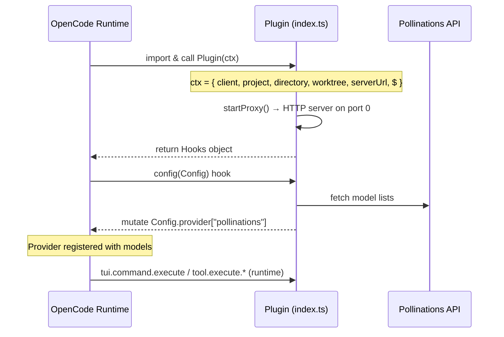

# 🏛️ OpenCode Plugin Architecture Study — V6 Tools Integration

> **Date:** 2026-02-12  
> **Status:** ✅ Verified against `@opencode-ai/plugin@latest` type definitions  
> **Sources:** OpenCode docs, NotebookLM (43 sources), `node_modules/@opencode-ai/plugin/dist/*.d.ts`, existing plugin source

---

## 1. Plugin Lifecycle



### Plugin Input (what we receive at init)

```typescript
type PluginInput = {
    client: ReturnType<typeof createOpencodeClient>; // SDK client for toasts, prompts, etc.
    project: Project;        // Current project info
    directory: string;       // CWD
    worktree: string;        // Git worktree root
    serverUrl: URL;          // OpenCode server URL
    $: BunShell;             // Shell API
};
```

---

## 2. Hooks Interface (Complete — from `index.d.ts`)

```typescript
interface Hooks {
    // --- CORE ---
    config?: (input: Config) => Promise<void>;          // Mutate config (providers, models)
    tool?: { [key: string]: ToolDefinition };            // Register custom tools for the agent
    auth?: AuthHook;                                      // Custom auth flow (/connect)
    event?: (input: { event: Event }) => Promise<void>;   // Listen to all events

    // --- CHAT / LLM ---
    "chat.message"?: (input, output) => Promise<void>;    // Modify user messages before LLM
    "chat.params"?: (input, output) => Promise<void>;     // Modify LLM params (temp, topP, etc.)
    "chat.headers"?: (input, output) => Promise<void>;    // Inject custom HTTP headers

    // --- COMMANDS ---
    "command.execute.before"?: (input: {
        command: string;      // e.g. "/pollinations mode pro"
        sessionID: string;
        arguments: string;    // everything after the command name
    }, output: {
        parts: Part[];        // Injectable response parts
    }) => Promise<void>;

    // --- TOOLS (Intercept built-in or custom tools) ---
    "tool.execute.before"?: (input: {
        tool: string;         // Tool name (e.g. "bash", "gen_image")
        sessionID: string;
        callID: string;
    }, output: {
        args: any;            // Mutable! Can modify args before execution
    }) => Promise<void>;

    "tool.execute.after"?: (input: {
        tool: string;
        sessionID: string;
        callID: string;
    }, output: {
        title: string;        // Display title
        output: string;       // Tool result text
        metadata: any;        // Extra metadata
    }) => Promise<void>;

    // --- PERMISSIONS ---
    "permission.ask"?: (input: Permission, output: {
        status: "ask" | "deny" | "allow";
    }) => Promise<void>;

    // --- EXPERIMENTAL ---
    "experimental.session.compacting"?: (...) => Promise<void>;
    "experimental.chat.messages.transform"?: (...) => Promise<void>;
    "experimental.chat.system.transform"?: (...) => Promise<void>;
    "experimental.text.complete"?: (...) => Promise<void>;
}
```

---

## 3. Custom Tools API (from `tool.d.ts`)

### The `tool()` Function

```typescript
import { z } from "zod";

function tool<Args extends z.ZodRawShape>(input: {
    description: string;
    args: Args;
    execute(args: z.infer<z.ZodObject<Args>>, context: ToolContext): Promise<string>;
}): ToolDefinition;

// tool.schema === z (Zod)
```

> **⚠️ CRITICAL:** `execute()` returns `Promise<string>` — NOT binary, NOT objects.  
> For media generation, tools must return **text descriptions** (URLs, paths, status messages).

### ToolContext

```typescript
type ToolContext = {
    sessionID: string;
    messageID: string;
    agent: string;
    abort: AbortSignal;           // For cancellation support
    metadata(input: {
        title?: string;
        metadata?: { [key: string]: any };
    }): void;                      // Set tool display title & metadata
    ask(input: AskInput): Promise<void>;  // Permission prompt to user
};

type AskInput = {
    permission: string;            // Permission key
    patterns: string[];            // File patterns
    always: string[];              // "Always allow" suggestions
    metadata: { [key: string]: any };
};
```

### Registering Tools from Plugin

```typescript
export const PollinationsPlugin: Plugin = async (ctx) => {
    return {
        // Text provider
        config(config) { /* mutate config.provider */ },
        
        // Custom tools for the agent
        tool: {
            gen_image: tool({
                description: "Generate an image using Pollinations AI",
                args: {
                    prompt: tool.schema.string().describe("Image description"),
                    model: tool.schema.string().optional().describe("Model ID"),
                },
                async execute(args, context) {
                    // ... call API, save file ...
                    context.metadata({ title: "🖼️ Generated image" });
                    return `Image saved to: /path/to/image.png\nModel: flux\nCost: 0.0002 pollen`;
                }
            }),
        },
    };
};
```

---

## 4. Current Plugin Architecture (v5.9)

```
src/
├── index.ts              ← Plugin entry, proxy server, exports Hooks
└── server/
    ├── config.ts         ← Config loading (multi-source with timestamp priority)
    ├── generate-config.ts ← Fetches text model lists, maps to OpenCode format
    ├── proxy.ts          ← HTTP proxy: /v1/chat/completions → text.pollinations.ai
    ├── quota.ts          ← Quota tracking, tier management
    ├── commands.ts       ← /pollinations * command handler (mode, usage, connect, etc.)
    ├── toast.ts          ← Toast notification system (status + log channels)
    ├── status.ts         ← Status bar hooks
    ├── pollinations-api.ts ← API helpers (fetchProfile, getDetailedUsage)
    └── index.ts          ← Re-exports
```

### Current Hooks Used

| Hook | File | Purpose |
|------|------|---------|
| `config()` | `index.ts` | Registers `pollinations` provider with text models |
| `tui.command.execute` | `commands.ts` → `createCommandHooks()` | Intercepts `/poll*` commands |
| Toast hooks | `toast.ts` → `createToastHooks()` | Status and log notifications |
| Status hooks | `status.ts` → `createStatusHooks()` | Status bar display |

### Hooks NOT Currently Used (available for V6)

| Hook | V6 Use Case |
|------|-------------|
| **`tool: {}`** | Register `gen_image`, `gen_video`, `gen_audio`, `gen_music`, `deepsearch`, `search_crawl_scrape` |
| `tool.execute.before` | Cost estimation + confirmation before paid tools execute |
| `tool.execute.after` | Usage tracking, toast notifications after generation |
| `command.execute.before` | Alternative to current command interception |
| `chat.headers` | Inject Authorization header for paid requests |

---

## 5. Confrontation: ROADMAP.md vs vision_v5_9_to_v6.md

### Areas of Agreement ✅

| Topic | ROADMAP | Vision | Status |
|-------|---------|--------|--------|
| Cost estimator | v6 feature | Detailed implementation | ✅ Aligned |
| Image tools | `pol_generate_image`, `pol_edit_image` | `generateImage()` handler | ✅ Aligned |
| Video tools | `pol_generate_video` | Async job webhook | ✅ Aligned |
| Audio TTS/STT | Commands `/tts`, `/stt` | Provider-agnostic | ✅ Aligned |
| Search tools | `pol_web_search`, `pol_deep_research` | Perplexity wrapper | ✅ Aligned |
| Safety Net integration | Pre-check + fallback per tool | Same concept | ✅ Aligned |

### Discrepancies & Outdated Info ⚠️

| Issue | ROADMAP Says | Reality (verified) | Resolution |
|-------|-------------|-------------------|------------|
| Free image models | `flux, zimage, turbo` | `sana, turbo, zimage` (no `flux` free) | Update to dynamic |
| Video models | `grok-video`, `ltx-2`, `seedance`, `veo` | `grok-video`, `ltx-2`, `seedance`, `seedance-pro`, `veo`, `wan` | Add `wan`, `seedance-pro` |
| Audio models | `whisper`, `elevenlabs` | `openai-audio` (TTS+STT), `elevenlabs`, `elevenmusic`, `whisper` | Add `openai-audio` as default |
| Vision file | TUI viewer with blessed/ink | **NOT possible** — tools return `string` only | Use file links + toast instead |
| Endpoints | `/v1/images/generate`, `/v1/video/generate` | Image: `image.pollinations.ai/prompt/...` (GET), Audio: `gen.pollinations.ai/openai/v1/audio/*` | Follow actual API |
| Tool names | `pol_generate_image`, `pol_edit_image` | Should be `gen_image`, `gen_video`, etc. per Guide | Follow Guide_v6_agent.md |
| Music | Mixed with audio in ROADMAP | Separate tool (`elevenmusic` model) — User confirmed | Separate `gen_music` tool |
| `enter.pollinations.ai` | Used as generation endpoint | **NOT** an endpoint — it's the credit/key management platform | Remove from tools code |

### Critical Architecture Difference

**Vision proposes:** Add new routes to the HTTP proxy (`/v1/images/generate`, `/v1/video/generate`)  
**Guide_v6_agent.md proposes:** Register tools via the `tool:` property in the plugin return  
**Real Plugin API confirms:** The `tool: {}` approach is the **official way** to add capabilities

> **Decision: Use `tool: {}` registration, NOT proxy route additions.**  
> The proxy stays for text completion only. Media tools are pure OpenCode custom tools.

---

## 6. V6 Tool Architecture (Derived from this Study)

```
src/
├── index.ts              ← Add tool: {} to return + import media tools
└── server/
    ├── (existing files unchanged)
    └── tools/              ← NEW: V6 tools module
        ├── index.ts         ← Tool registry (exports all tools)
        ├── discovery.ts     ← Dynamic model fetching from API endpoints
        ├── schemas.ts       ← Zod schema builders (dynamic model enums)
        ├── estimator.ts     ← Cost estimation from API pricing data
        ├── storage.ts       ← File save + auto-naming
        └── tools/
            ├── gen_image.ts       ← Image generation tool
            ├── gen_video.ts       ← Video generation tool
            ├── gen_audio.ts       ← TTS/STT tool (openai-audio default)
            ├── gen_music.ts       ← Music generation tool (elevenmusic)
            ├── deepsearch.ts      ← Deep research tool (perplexity-reasoning)
            └── search_crawl_scrape.ts ← Web search tool (perplexity-fast, nomnom)
```

### Tool Return Format

Since `execute()` must return `Promise<string>`, each tool returns a formatted text block:

```
🖼️ Image Generated
━━━━━━━━━━━━━━━━━━━
Model: flux (Flux Schnell)
Size: 1024×1024
Cost: 0.0002 🌻 pollen
Saved: /home/user/Downloads/pollinations/blue-bird-2026-02-12.png
URL: https://image.pollinations.ai/prompt/blue%20bird?model=flux&width=1024&height=1024
```

### Cost Confirmation Flow (via `context.ask()`)

```typescript
// In tool execute():
const cost = estimateCost(model, params);
if (cost > 0 && config.costConfirmation !== 'never') {
    await context.ask({
        permission: `pollinations.generate.${cost.toFixed(4)}`,
        patterns: [],
        always: [`pollinations.generate.${model}`],
        metadata: {
            action: "Generate image",
            model: model,
            estimatedCost: `${cost.toFixed(4)} 🌻 pollen`,
            balance: quota.tierRemaining
        }
    });
}
```

---

## 7. Key Constraints for Implementation

1. **`execute()` returns `string`** — No binary data, no JSON objects
2. **`tool.schema` = Zod** — Dynamic enums must be rebuilt on model discovery
3. **`context.abort`** — Must respect AbortSignal for long video generations
4. **`config()` runs once at startup** — Model lists cached, refreshable via command
5. **Proxy remains text-only** — No new routes for media
6. **Toast is via client SDK** — `client.tui.showToast()` for status updates
7. **Commands via `command.execute.before`** — New `/image`, `/video`, `/tts`, `/stt` commands must intercept early and inject response `parts`
